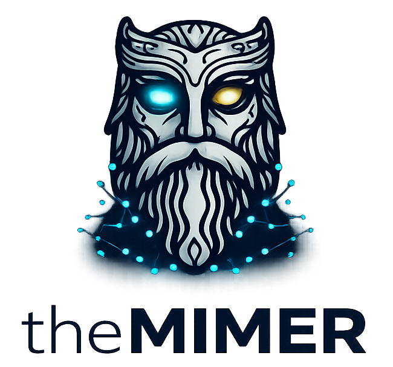

<p align="center">
  
</p>

<h1 align="center">theMIMER</h1>

<p align="center"><strong>MIMER Is Mythical Enhanced Reasoning</strong></p>

theMIMER is an intelligent, local-first AI assistant that runs entirely on your own hardware. It combines a local LLM with a Retrieval-Augmented Generation (RAG) knowledge base, multi-persona thinking strategies, vision, image generation, agentic tool use, and a built-in web chat interface.

Feed it your documentation, source code, PDFs, and web pages. Ask questions, analyze code, generate reports, find bugs, and get answers grounded in your actual data - not hallucinations.

Copyright 2026 Components4Developers - Kim Bo Madsen. See [LICENSE](LICENSE) for terms.

---

## Key Features

- **Local-first AI** - Runs on your GPU with no cloud dependency. Your data never leaves your machine.
- **RAG Knowledge Base** - Ingest documents, source code, PDFs, and web pages. Answers are grounded in your actual content.
- **Multi-model architecture** - Use a small fast model for routing and a large capable model for answers. Optionally add external providers (Gemini, Claude, OpenAI, DeepSeek) for complex tasks.
- **Multi-persona thinking** - Critique, debate, code review, and meta-orchestration strategies where multiple LLM personas analyze your question from different angles.
- **Vision** - Describe, analyze, and compare images. Upload images in the web chat for multimodal conversations.
- **Image generation** - Generate images from text prompts using local Stable Diffusion.
- **Agentic tools** - The code agent can read, analyze, and modify source files. External tools (compiler, grep, test runner) extend its capabilities.
- **Web chat UI** - Built-in web server with a modern chat interface, file upload, image preview, streaming responses, and Mermaid diagram rendering.
- **OpenAI-compatible API** - Expose your local models as an OpenAI-compatible endpoint for integration with other tools.
- **Self-improvement** - Autonomous feedback loop that tests itself, finds weaknesses, and generates skills to improve.
- **Fully configurable** - Every aspect is controlled through well-documented INI configuration files.

---

## Quick Start

### 1. Download theMIMER

Download the latest `theMIMER.exe` from the releases page.

### 2. Download required DLLs

theMIMER requires the **llama.cpp** shared libraries. Download the build matching your GPU:

**llama.cpp** (required):
- Go to: https://github.com/ggml-org/llama.cpp/releases
- Download the Windows release matching your GPU:
  - **NVIDIA:** `llama-bXXXX-bin-win-cuda-cu12.x-x64.zip`
  - **AMD / Intel / Any GPU:** `llama-bXXXX-bin-win-vulkan-x64.zip`
  - **CPU only:** `llama-bXXXX-bin-win-avx2-x64.zip`
- Extract and place the following DLLs in the same directory as `theMIMER.exe`:
  - `llama.dll`
  - `ggml.dll`
  - `ggml-base.dll`
  - `ggml-cpu.dll`
  - `ggml-cuda.dll` (NVIDIA CUDA build only)
  - `ggml-vulkan.dll` (Vulkan build only)
  - Any other `ggml-*.dll` files included in the release

**GPU drivers:**
- **NVIDIA:** Install the CUDA Toolkit matching your llama.cpp build
  (e.g., CUDA 12.x): https://developer.nvidia.com/cuda-toolkit
  Keep your GPU drivers up to date: https://www.nvidia.com/drivers
- **AMD:** Install the latest AMD Adrenalin drivers with Vulkan support:
  https://www.amd.com/en/support
- **Intel:** Install the latest Intel GPU drivers with Vulkan support:
  https://www.intel.com/content/www/us/en/download-center
- **CPU only:** No GPU drivers needed, but inference will be significantly slower

### 3. Download a chat model (GGUF)

You need at least one LLM model in GGUF format. Recommended starting models:

| Model | Size | VRAM | Good for | Download |
|-------|------|------|----------|----------|
| Qwen2.5-1.5B-Instruct (Q5_K_M) | ~1.1 GB | ~2 GB | Fast routing, reranking | [HuggingFace](https://huggingface.co/Qwen/Qwen2.5-1.5B-Instruct-GGUF) |
| Qwen3.5-9B variant (Q8_0) | ~9.5 GB | ~12 GB | Chat, code, analysis, **vision** | See below |

The recommended main model is a Qwen 3.5 9B variant with vision support. The variant used during development is `Qwen3.5-9B-Uncensored-HauhauCS-Aggressive-Q8_0.gguf` with its matching CLIP projector `mmproj-Qwen3.5-9B-Uncensored-HauhauCS-Aggressive-BF16.gguf`. Search HuggingFace for "Qwen3.5 9B GGUF" to find this or similar community variants that include both the model and mmproj file.

A single model handles chat, code, analysis, and vision, so you do not need separate models for different tasks.

Place the `.gguf` files in the same directory as `theMIMER.exe` (or use full paths in the config).

### 4. Download an embedding model (GGUF)

Required for the RAG knowledge base:

| Model | Dimensions | Download |
|-------|-----------|----------|
| nomic-embed-text-v1.5 (Q8_0) | 768 | [HuggingFace](https://huggingface.co/nomic-ai/nomic-embed-text-v1.5-GGUF) |

Place in the same directory as `theMIMER.exe`.

### 5. Configure

Copy the sample configuration files to the theMIMER directory and rename them:

```
theMIMER.settings.ini
theMIMER.settings.providers.ini
theMIMER.settings.rules.ini
theMIMER.settings.tools.ini
theMIMER.settings.skills.ini
theMIMER.settings.strategies.ini
theMIMER.settings.selfimprove.ini
```

At minimum, edit `theMIMER.settings.providers.ini`:

- Set `ModelPath` in `[LLMProvider.1]` to your main model filename
- Set `ModelPath` in `[LLMProvider.2]` to your small routing model filename

And `theMIMER.settings.ini`:

- Set `Model` in `[Embedding]` to your embedding model filename
- Optionally configure `[Sources]` to point at your document and code folders

### 6. Run

```
theMIMER.exe
```

On first run, theMIMER will:
1. Load the embedding model
2. Load the LLM model(s)
3. Ingest any configured sources into the knowledge base
4. Start the web chat server

Open your browser to `http://localhost:8080` and start chatting.

---

## Optional: Vision

Vision enables theMIMER to understand and describe images. If you are using the recommended Qwen 3.5 9B variant, it already supports vision - you just need its matching CLIP projector file.

| File | Purpose |
|------|---------|
| `Qwen3.5-9B-Uncensored-HauhauCS-Aggressive-Q8_0.gguf` | Vision-capable chat model (same as main model) |
| `mmproj-Qwen3.5-9B-Uncensored-HauhauCS-Aggressive-BF16.gguf` | CLIP projector for the model |

Both files are available from the same HuggingFace repository. Search for "Qwen3.5 9B Uncensored HauhauCS GGUF".

**Additional DLL required for vision:**

- `mtmd.dll` - Included in the llama.cpp release (multimodal support)

**Configuration** (in `theMIMER.settings.providers.ini`):

```ini
[LLMProvider.1]
ModelPath=Qwen3.5-9B-Uncensored-HauhauCS-Aggressive-Q8_0.gguf
ClipModelPath=mmproj-Qwen3.5-9B-Uncensored-HauhauCS-Aggressive-BF16.gguf
```

And enable vision in `theMIMER.settings.ini`:

```ini
[Vision]
Enabled=1
```

---

## Optional: Image Generation

theMIMER can generate images from text prompts using local Stable Diffusion.

**Required:**

- `stable-diffusion.dll` - Build from https://github.com/leejet/stable-diffusion.cpp
  (Download a pre-built release or compile with CUDA support)
- A Stable Diffusion model in `.safetensors` format, e.g.:
  - `v1-5-pruned.safetensors` (~4 GB VRAM) from [HuggingFace](https://huggingface.co/stable-diffusion-v1-5/stable-diffusion-v1-5)

Place `stable-diffusion.dll` next to `theMIMER.exe` and configure in `theMIMER.settings.ini`:

```ini
[ImageGeneration]
Enabled=1
Provider=local
SDModel=v1-5-pruned.safetensors
```

---

## Optional: External LLM Providers

theMIMER works fully offline with local models. Optionally, you can add external providers for tasks that benefit from larger models, such as complex analysis, evaluation, or self-improvement scoring.

Supported providers (configured in `theMIMER.settings.providers.ini`):

| Provider | Type | Notes |
|----------|------|-------|
| Google Gemini | `openai` (compatible endpoint) | Very large context, competitive pricing |
| Anthropic Claude | `anthropic` | Excellent reasoning and evaluation |
| OpenAI GPT | `openai` | Strong all-rounder |
| DeepSeek | `openai` (compatible endpoint) | Strong at code, very affordable |
| Groq | `openai` (compatible endpoint) | Very fast inference |

Set `Enabled=1` and provide your API key for any provider you want to use. All external providers are disabled by default.

---

## Directory Layout

After setup, your theMIMER directory should look like this:

```
theMIMER/
  theMIMER.exe                          - The executable
  LICENSE                               - License file
  llama.dll                             - llama.cpp core library
  ggml.dll                              - GGML backend library
  ggml-base.dll                         - GGML base operations
  ggml-cpu.dll                          - GGML CPU backend
  ggml-cuda.dll                         - GGML CUDA backend (NVIDIA GPU)
  ggml-vulkan.dll                       - GGML Vulkan backend (AMD/Intel/NVIDIA GPU)
  mtmd.dll                              - Multimodal support (optional, for vision)
  stable-diffusion.dll                  - Stable Diffusion (optional, for image gen)
  qwen2.5-7b-instruct-q8_0.gguf        - Main chat model (example)
  qwen2.5-1.5b-instruct-q5_k_m.gguf    - Small routing model (example)
  nomic-embed-text-v1.5-q8_0.gguf       - Embedding model
  mmproj-*.gguf                         - Vision CLIP projector (optional)
  v1-5-pruned.safetensors               - Stable Diffusion model (optional)
  theMIMER.settings.ini                 - Main configuration
  theMIMER.settings.providers.ini       - LLM provider registry
  theMIMER.settings.rules.ini           - Query rules and router extensions
  theMIMER.settings.tools.ini           - External tool definitions
  theMIMER.settings.skills.ini          - Thinking skill definitions
  theMIMER.settings.strategies.ini      - Multi-persona strategies
  theMIMER.settings.selfimprove.ini     - Self-improvement configuration
  knowledge.kbvs                        - Vector store (created on first ingest)
  uploads/                              - Per-session file workspace
  generated_images/                     - Generated images output
  skills/                               - Thinking skill .md files
```

---

## Configuration Files

theMIMER is configured through seven INI files, each fully documented with inline comments explaining every setting, its valid values, and its defaults.

| File | Purpose |
|------|---------|
| `theMIMER.settings.ini` | Main settings: embedding, retrieval, orchestration, context, sampling, conversation, output, upload, chat server, vision, image generation, knowledge sources |
| `theMIMER.settings.providers.ini` | LLM provider registry: local models, external APIs, capabilities, selection strategies, query routing, cost controls |
| `theMIMER.settings.rules.ini` | Query rules: keyword/regex matching, intent forcing, scoped retrieval, router extensions |
| `theMIMER.settings.tools.ini` | External tools: compiler, grep, test runner, or any command-line tool the agent can invoke |
| `theMIMER.settings.skills.ini` | Thinking skills: code analysis, bug finding, refactoring, test generation, document writing, diagram generation |
| `theMIMER.settings.strategies.ini` | Multi-persona strategies: research, security, code analysis, translation teams with configurable personas |
| `theMIMER.settings.selfimprove.ini` | Self-improvement: autonomous testing, evaluation, gap detection, skill generation |

---

## Pipeline Architecture

theMIMER processes queries through a layered pipeline. Two settings control the depth:

**Query Mode** (`[Query] Mode`) sets the pipeline ceiling - which processing phases are available:

```
direct      Raw LLM only. No retrieval, no routing, no tools.
    |
retrieval   + RAG retrieval (vector + BM25 hybrid search)
    |
guided      + LLM router, skills, HyDE, query expansion
    |
agentic     + Tool use (code agent, upload agent) + query decomposition
    |
deep        + Multi-persona thinking strategies
```

**Thinking Mode** (`[LLM] Thinking`) controls how the LLM reasons - but only activates when Mode is `deep`:

| Thinking | Description |
|----------|-------------|
| `off` | Direct LLM response, no multi-persona reasoning |
| `critique` | Draft-then-critique: generate, review, refine |
| `debate` | Multiple personas argue perspectives, synthesizer merges |
| `code` | Specialized code analysis personas |
| `auto` | Auto-classify each query and pick the best strategy |
| `meta` | Iterative orchestrator: select, execute, score, refine |

---

## Runtime Commands

theMIMER supports slash commands in both the console and web chat. Type `/help` for a full list. Key commands:

| Command | Description |
|---------|-------------|
| `/help` | List all commands |
| `/status` | System status overview |
| `/querymode <mode>` | Set pipeline mode: direct, retrieval, guided, agentic, deep |
| `/think <strategy>` | Set thinking: off, critique, debate, code, auto, meta |
| `/providers` | Show provider status and statistics |
| `/router show` | Show router configuration |
| `/skills` | List active skills |
| `/rules list` | List active rules |
| `/tools list` | List registered external tools |
| `/ingest` | Ingest configured knowledge sources |
| `/clear` | Clear conversation history |

---

## System Requirements

- **OS:** Windows 10/11 (64-bit)
- **GPU:** Any GPU supported by llama.cpp (strongly recommended):
  - **NVIDIA** via CUDA (best performance, most tested)
  - **AMD** via Vulkan or ROCm
  - **Intel** via Vulkan or SYCL
  - 8 GB VRAM minimum for a 7B model
  - 12-16 GB VRAM recommended for larger models + vision
  - 24+ GB VRAM for 24B+ models
- **CPU:** Any modern x64 processor (CPU-only mode is supported but slow)
- **RAM:** 16 GB minimum, 32 GB recommended
- **Disk:** 10-20 GB for models and knowledge base

---

## Links

- **llama.cpp releases:** https://github.com/ggml-org/llama.cpp/releases
- **stable-diffusion.cpp:** https://github.com/leejet/stable-diffusion.cpp
- **NVIDIA CUDA Toolkit:** https://developer.nvidia.com/cuda-toolkit
- **NVIDIA Drivers:** https://www.nvidia.com/drivers
- **AMD Drivers:** https://www.amd.com/en/support
- **Intel Drivers:** https://www.intel.com/content/www/us/en/download-center
- **GGUF Models (HuggingFace):** https://huggingface.co/models?sort=trending&search=gguf
- **Nomic Embed (embedding model):** https://huggingface.co/nomic-ai/nomic-embed-text-v1.5-GGUF
- **Components4Developers:** https://components4developers.blog

---

## License

theMIMER is free to use for individuals and organizations. See [LICENSE](LICENSE) for the full terms, including the non-compete restriction.

Copyright 2026 Components4Developers - Kim Bo Madsen. All rights reserved.
